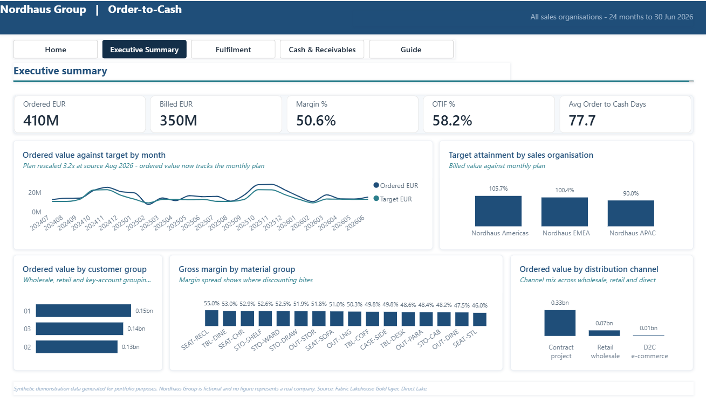
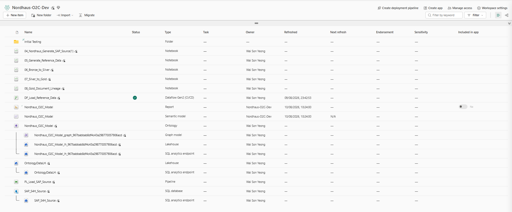

# Order to Cash, end to end, on Microsoft Fabric

A complete, rebuildable data platform: a synthetic **SAP S/4HANA** source, mirrored into a
**Lakehouse**, conformed through a **medallion architecture**, modelled as a star schema, and served
through a **Direct Lake semantic model**, an **ontology** and a **Power BI report**.

Everything here is free to reuse. The data is invented; the architecture and the modelling decisions
are not.

**📘 [Start with the guided walkthrough →](docs/guide.html)** — plain-English, nine steps, about
twenty hours. No prior Fabric experience assumed.



---

## What you get

| Folder | Contents |
|---|---|
| `sql/` | The SAP source database — ~25 tables with genuine SAP names (`VBAK`, `VBAP`, `LIKP`, `VBRK`, `BSID`, `BSAD`, `VBFA`, `CDHDR`, `CDPOS`) |
| `notebooks/` | The data generator and the three transformation notebooks (Bronze → Silver → Gold → lineage) |
| `model/` | All 24 DAX measures, ready to paste into DAX query view |
| `docs/` | The walkthrough, plus the build notes, results and known limitations |

## What it builds

Seven Fabric components in one workspace:



1. **SQL Database** — stands in for SAP S/4HANA
2. **Mirroring → Lakehouse** — Bronze landing in OneLake, no pipeline required
3. **Dataflow Gen2** — reference data that never lived in SAP (FX rates, sales targets)
4. **Notebooks (PySpark)** — Silver conforming, SCD2 dimensions, Gold star schema
5. **Semantic model** — Direct Lake on OneLake, 13 tables, 24 measures
6. **Ontology** — 16 keyed entity types bound live to Gold
7. **Data Pipeline** — metadata-driven extraction *(partial — see limitations)*

## Before you start

**You need a work or school Microsoft account.** The Fabric trial **cannot** be activated with a
personal account (Gmail, outlook.com, hotmail). If you don't have one, the free
[Microsoft 365 Developer Program](https://developer.microsoft.com/microsoft-365/dev-program) or a
Microsoft 365 Business trial on a domain you control will both give you a qualifying account. This
is the most common reason people stall before step one.

Then sign in at [app.fabric.microsoft.com](https://app.fabric.microsoft.com), open the account menu
and choose **Start trial** — 60 days of full Fabric capacity at no cost.

> **⏳ The trial expires, and when it does the workspace becomes unreachable.** Note your expiry date
> and export your work before it lapses. Step 9 of the guide covers exactly what to save.

## Quick start

```
1. Create a Fabric workspace on your Trial capacity
2. New item -> SQL database        -> run sql/01_SAP_Source_DDL.sql
3. Import notebooks/04_...ipynb    -> Run all   (generates two years of trading)
4. New item -> Lakehouse           -> enable mirroring on the SQL database
5. Import notebooks/06_...ipynb    -> Run all   (Bronze -> Silver)
6. Import notebooks/07_...ipynb    -> Run all   (Silver -> Gold)
7. New semantic model over the Gold tables -> paste model/measures.dax
8. Generate the ontology, set a key on every entity type
9. Build the report in Power BI Desktop, live-connected
```

Full detail, with screenshots and every trap, is in **[the walkthrough](docs/guide.html)**.

## The finding worth stealing

Delivery performance is reported **twice** — against the date the customer asked for (**61.3%**) and
against the date the business confirmed internally (**5.4%**).

Both are correct. Publishing only one hides a modelling choice worth fifty percentage points, and it
is precisely the number that ends up quoted in a board pack. The report shows both, with the reason
stated on the page.

## Ten traps already found for you

| Trap | What you'll see |
|---|---|
| Workspace on the wrong capacity | Most Fabric item types unavailable |
| Lakehouse vs its SQL endpoint | `No default context found` — identical names in the picker |
| Notebook import rejected | `400 Bad Request` with no useful detail |
| Copy step defaults to Binary | *"Destination must be binary when source is of binary format"* |
| `Select all` ignores the search filter | 36 tables added instead of 13 |
| Direct Lake staleness | *"needs to be recalculated"* — confirmation, not an error |
| TMDL editor read-only | **Apply** greyed out |
| Percentages render as `0.58` | Missing format string |
| Ontology relationships ≠ graph edges | Graph shows disconnected nodes, no warning |
| Graph edges do not persist | Gone after closing and reopening the item |

## Known limitations

Stated plainly, because a project claiming completeness invites exactly the question it can't answer.

- **The data is synthetic.** Nordhaus Group is fictional; no figure represents a real company.
- **The Data Pipeline is partial** — one verified Copy activity, not the full ForEach framework.
- **Fabric Graph was abandoned** — edges did not survive a reopen. The edge *tables* are valid and
  queryable; only the traversal UI was lost.
- **Five report pages of seven planned**, and 24 measures of roughly 70.
- **Notebook `05_Generate_Reference_Data`** exists in the source workspace but is not included here —
  its output (FX rates and sales targets) is produced by the Dataflow Gen2 described in
  `docs/DATAFLOW_GEN2_SPEC.md`.
- **Trial capacity only.** Nothing here establishes production sizing or cost.

## Licence

MIT — see [LICENSE](LICENSE). Use it, fork it, teach from it.

If you rebuild this and get further than I did — particularly on the pipeline or the graph — I'd
genuinely like to hear about it.

---

**Yeong Wai Son** · Finance Transformation & Analytics
[Portfolio](https://biventure2025.github.io) · waisonyeong@gmail.com
